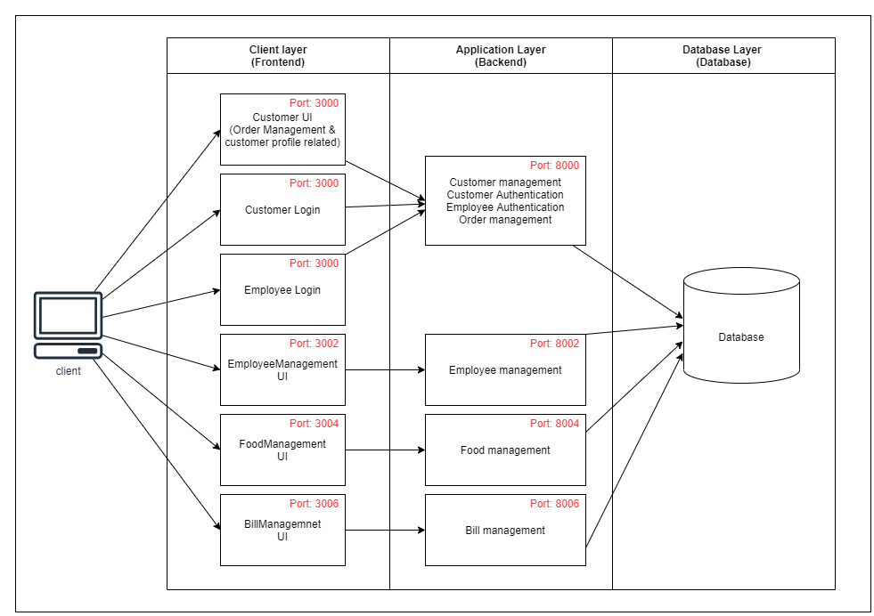

# NoQueues

The main purpose of this “NoQueues” online canteen food ordering system is to automate existing traditional manual food ordering system with advanced computerized software, allowing valuable data to be easily accessed, managed and stored for longer periods of time. The other main objective of this system is to reduce the queue of people who are coming to the canteen to buy food.  
Here, only the registered users can get our services from our web application. The registered user can access their account with their login credentials and enter to our system. The Registered user can place orders and come to the canteen when food is ready and pay for them manually when collecting their food.

---

- Development Tech Stack - MERN (MongoDB, Express, React, Node)
  
---

- Installation process
  
1. Install dependencies of all services.
2. Run all 4 services.

---

- Things to consider
  
1. examine the architecture of the system

